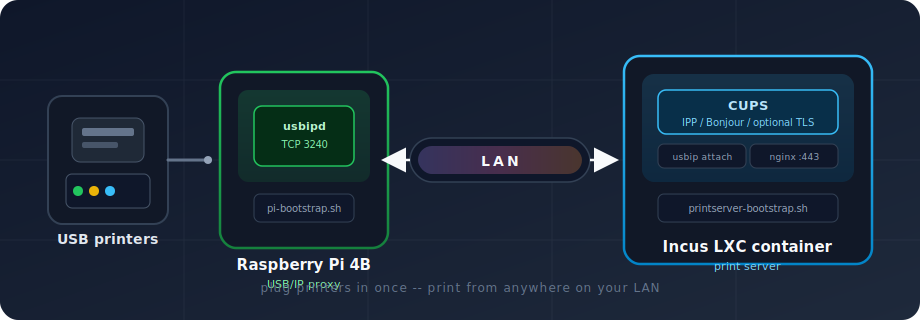

# printstack

**USB printers, anywhere on your network.**

<p align="center">
  
</p>

printstack grew out of the same idea as **BLEProxy**: take a physical adapter that normally has to sit right next to a computer, and make it available over the network instead. BLEProxy does that for Bluetooth -- your BLE dongle lives on one box, and clients connect to it over IP. printstack does the same trick for USB printers. Plug them into a Raspberry Pi, and an Incus container on your LAN picks them up over USB/IP and shares them through CUPS. Your laptops and phones do not need a USB cable, a driver hunt, or a printer sitting on the desk beside them.

**Who is this for?** Homelabbers, small-office tinkerers, and anyone who already runs Linux infrastructure and owns perfectly good USB-only printers. Maybe the printer lives in the garage, the server closet, or a shelf in the laundry room -- nowhere near the machines that actually need to print. Maybe you run Incus or LXC already and want printing to behave like the rest of your stack: reproducible, documented, and easy to rebuild. You do not need to be a CUPS guru; you do need a Pi, a host for containers, and comfort running a few bootstrap scripts.

**When and why reach for it?** Reach for printstack when "just share the printer on the network" is not enough -- when you want the Pi to be a dedicated USB/IP proxy, the print server to live in a container with a real LAN address, and both sides to reset themselves on a schedule so configuration drift does not accumulate. Nightly reprovisioning wipes the slate clean: the Pi reboots from cloud-init, the container is destroyed and recreated, and your printers come back without you babysitting services. Use it when you care about that operational calm more than about clicking through a consumer router's USB-sharing wizard.

---

## How it works (60 seconds)

| Piece | What it does |
|-------|----------------|
| **Raspberry Pi 4B** | Printers plug in here. `usbipd` exports them on TCP 3240. |
| **Your LAN** | The Pi and the print server talk over ordinary Ethernet/WiFi. |
| **Incus container** | Attaches the remote USB devices, registers them in CUPS, and advertises them to the network. |
| **Your devices** | Add a printer once (Bonjour/IPP). Print. |

Both nodes are **immutable**: packages are baked into images ahead of time, and a 02:00 timer reprovisions everything. No creeping `apt upgrade` surprises on production printing night.

---

## Quick start

### What you need

- **Raspberry Pi 4B** + SD card + USB printer(s)
- **Incus host** on the same LAN (storage pool, SSH from your workstation)
- **A management machine** with `bash`, `incus`, and (for flashing) `pv` / `xz-utils` -- missing flash tools are installed automatically

### 1. Configure secrets

```bash
cp shared.env.example shared.env
cp pi-bootstrap.env.example pi-bootstrap.env
cp printserver-bootstrap.env.example printserver-bootstrap.env

chmod 600 shared.env pi-bootstrap.env printserver-bootstrap.env
```

Edit the files: SSH keys, LAN subnet, Pi hostname, SD card device (`DEVICE=/dev/sdX`), WiFi password, Incus remote, container MAC address.

### 2. Flash the Pi

```bash
printstack flash --force
```

Insert the card, power on the Pi, connect your printers. First boot is hands-off.

### 3. Build the print server image (once)

```bash
./printserver-image-build.sh
```

### 4. Deploy the print server

```bash
./printserver-bootstrap.sh
```

Printers should appear in CUPS and on the network via Bonjour. Open `http://<container-ip>:631` from a machine on the LAN to confirm.

### Day-two commands

```bash
printstack refresh    # rebuild image + reprovision container (immutable redeploy)
printstack flash      # update Pi cloud-init or re-flash SD card
printstack help       # full CLI reference
```

---

## Nice extras

**Virtual printers** -- No hardware handy? Set `ENABLE_VIRTUAL_PRINTERS=3` in `pi-bootstrap.env` to stand up fake USB printers for testing.

**TLS** -- Set `ENABLE_LETSENCRYPT=true` in `printserver-bootstrap.env` for HTTPS on port 443 (DNS-01 via Namecheap; no inbound 80/443 required).

**Firewall** -- Both nodes ship with `ufw`. Printing is limited to `PRINT_CIDRS` from `shared.env`; SSH can be restricted with `SSH_CIDRS`.

---

## When things go sideways

| Symptom | Things to check |
|---------|-----------------|
| Pi won't join WiFi | `WIFI_PASSWORD` in `pi-bootstrap.env`; re-flash. 5 GHz needs the brcmfmac NVRAM patch (`ccode=US` in bootstrap output). |
| cloud-init skipped on Pi | `ds=nocloud` in `/boot/firmware/current/cmdline.txt`; fresh `meta-data` instance-id. |
| usbip attach fails | Pi up? `nc -zv usbproxy.printstack.local 3240`. Printers connected **before** boot? |
| CUPS printers offline | Re-run `printserver-bootstrap.sh` to rediscover and re-register. |

---

## Repository map

```
printstack.sh                  # CLI: flash, refresh
pi-bootstrap.sh                # Pi SD card + cloud-init
printserver-bootstrap.sh       # Incus container + CUPS
printserver-image-build.sh     # Pre-baked container image
shared.env.example             # Keys, LAN, hostnames
pi-bootstrap.env.example       # SD card, WiFi, virtual printers
printserver-bootstrap.env.example
docs/architecture.svg          # Diagram above
agentstartstack/                   # Deep docs for contributors and agents
```

---

## For developers

Architecture details, bootstrap phases, gotchas, and agent workflow live in [`agentstartstack/`](agentstartstack/README.md). Start with [`architecture.md`](agentstartstack/architecture.md) if you are changing how the pieces fit together.

---

*Inspired by BLEProxy's "adapter over IP" pattern. Built for people who want printing to be boring in the best possible way.*